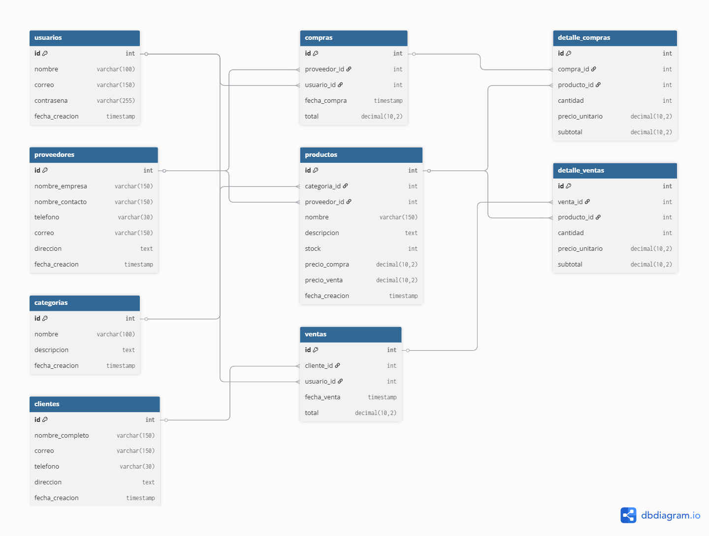

# Sistema BD Ventas Inventario

Proyecto de base de datos relacional desarrollado en MySQL para la gestión de ventas, compras e inventario.

---

## Descripción

El proyecto implementa una estructura de base de datos orientada a sistemas comerciales, permitiendo administrar:

- usuarios
- clientes
- proveedores
- categorías
- productos
- compras
- ventas
- inventario

Además, incorpora consultas SQL avanzadas, vistas reutilizables, procedimientos almacenados y triggers para automatización de procesos.

---

## Tecnologías utilizadas

- MySQL
- Xampp

---

## Estructura del proyecto

```text
sistema-bd-ventas-inventario/
├── database/
│   ├── esquema.sql
│   ├── datos_prueba.sql
│   ├── queries.sql
│   ├── views.sql
│   ├── procedures.sql
│   └── triggers.sql
├── docs/
│   └── database-documentation.md
├── diagrams/
└── README.md
```

---

## Funcionalidades implementadas

### Modelo relacional

- Relaciones entre entidades.
- Claves primarias.
- Claves foráneas.
- Integridad referencial.
- Normalización básica.

### Gestión comercial

- Registro de compras.
- Registro de ventas.
- Gestión de inventario.
- Gestión de clientes.
- Gestión de proveedores.
- Gestión de categorías y productos.

### Consultas SQL

- JOINs complejos.
- Reportes comerciales.
- Consultas analíticas.
- Inventario valorizado.
- Productos con stock bajo.
- Ventas por cliente.
- Ventas por producto.

### Vistas SQL

- Reportes reutilizables.
- Resumen de ventas.
- Inventario valorizado.
- Ventas detalladas.

### Procedimientos almacenados

- Registro automatizado de ventas.
- Registro automatizado de compras.
- Validación de stock.

### Triggers

- Actualización automática de inventario.
- Automatización de movimientos de stock.

---

## Archivos principales

| Archivo | Descripción |
|---|---|
| esquema.sql | Estructura de tablas y relaciones |
| datos_prueba.sql | Inserción de datos de prueba |
| queries.sql | Consultas SQL avanzadas |
| views.sql | Vistas reutilizables |
| procedures.sql | Procedimientos almacenados |
| triggers.sql | Automatización mediante triggers |

---

## Ejecución del proyecto

### Crear base de datos

Ejecutar:

```sql
source esquema.sql;
```

### Insertar datos de prueba

```sql
source datos_prueba.sql;
```

### Ejecutar consultas

```sql
source queries.sql;
```

### Crear vistas

```sql
source views.sql;
```

### Crear procedimientos

```sql
source procedures.sql;
```

### Crear triggers

```sql
source triggers.sql;
```

---

## Consultas destacadas

### Productos con stock bajo

```sql
SELECT *
FROM productos
WHERE stock <= 5;
```

### Total vendido por cliente

```sql
SELECT
    c.nombre_completo,
    SUM(v.total) AS total_comprado
FROM ventas v
INNER JOIN clientes c
    ON v.cliente_id = c.id
GROUP BY c.nombre_completo;
```

### Inventario valorizado

```sql
SELECT
    nombre,
    stock,
    precio_compra,
    (stock * precio_compra) AS valor_inventario
FROM productos;
```

---

## Buenas prácticas implementadas

- Diseño relacional.
- Integridad referencial.
- Separación entre encabezado y detalle.
- Consultas optimizadas mediante JOIN.
- Automatización mediante triggers.
- Procedimientos almacenados.
- Organización modular de scripts SQL.
- Documentación técnica.

---

## Diagrama entidad-relación



## Autor

Jorge García